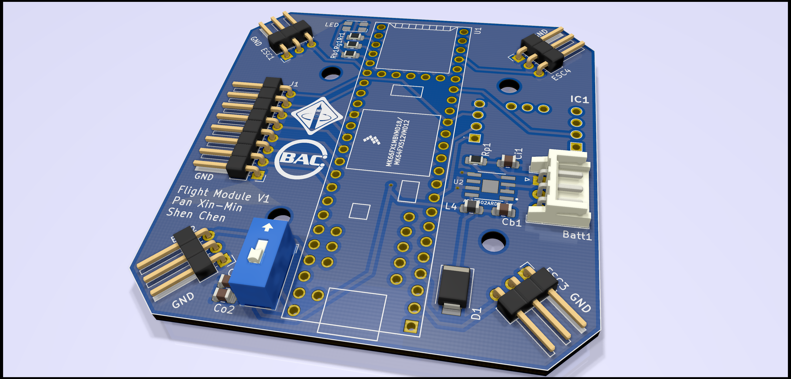
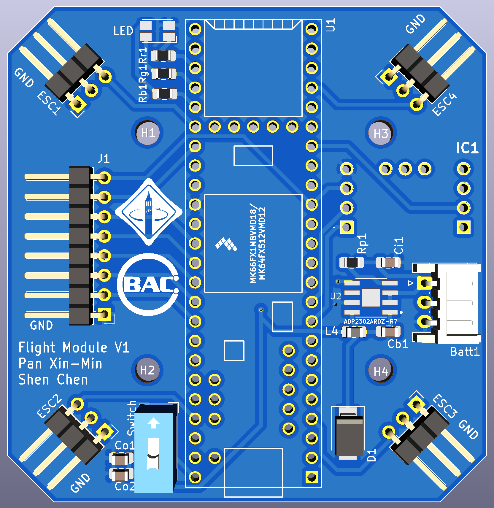

# TeensyFCFS v0.0
Teensy 3.5 Flight Controller From Scratch. Nothing works, everything is on fire. This is fine. We are working on it.

TeensyFCFS is an attempt to create a flight controller using a Teensy 3.5. This a personal project on trying to build a drone from the ground up (except the frame but I might have something for that too coming soon-ish ;) ). Thanks to UC Berkeley's Hands-On PCB Engineering Decal for teaching how to create a PCB. This firmware is designed to run on that PCB. Schematics coming soon!

